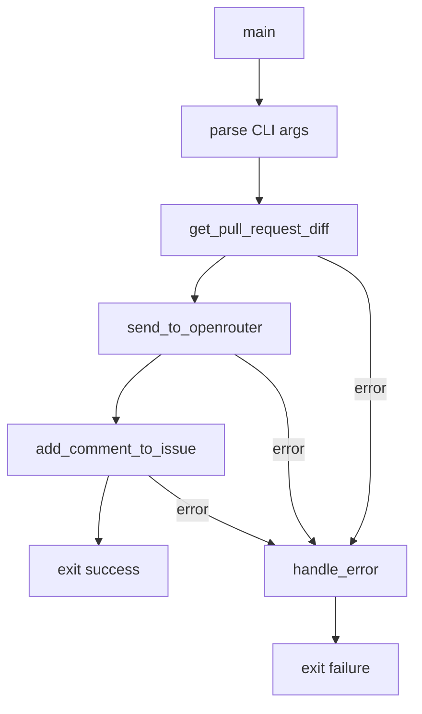

# Bot.py Refactoring Plan

## Overview
Refactor [`bot.py`](../bot.py) to improve code organization, add CLI argument support, and unify error handling.

## Current Issues
1. All code is in global scope - no functions
2. Hardcoded URLs (pull request #3, issue #2)
3. Inconsistent error handling (some use `exit(1)`, some don't)
4. No CLI argument support

## Proposed Architecture

### Function Structure



### Functions to Create

#### 1. `get_env_var(name: str) -> str`
- **Purpose**: Read and validate environment variable
- **Parameters**:
  - `name`: Name of the environment variable
- **Returns**: The environment variable value
- **Error Handling**: Raises `BotError` if variable is not set

#### 2. `get_pull_request_diff(pr_number: int, api_token: str) -> str`
- **Purpose**: Fetch the diff from a pull request
- **Parameters**:
  - `pr_number`: The pull request number to review
  - `api_token`: Gitea API token for authentication
- **Returns**: The diff content as a string
- **Error Handling**: Raises custom exception on failure

#### 3. `send_to_openrouter(diff: str, api_token: str, model: str = "z-ai/glm-4.7") -> dict`
- **Purpose**: Send the diff to OpenRouter API for code review
- **Parameters**:
  - `diff`: The pull request diff content
  - `api_token`: OpenRouter API token
  - `model`: The model to use (default: "z-ai/glm-4.7")
- **Returns**: Parsed JSON response from OpenRouter
- **Error Handling**: Raises custom exception on failure

#### 4. `add_comment_to_issue(issue_number: int, review_text: str, cost: str, api_token: str) -> dict`
- **Purpose**: Post the review as a comment to an issue
- **Parameters**:
  - `issue_number`: The issue number to comment on
  - `review_text`: The review content from OpenRouter
  - `cost`: The cost information from OpenRouter response
  - `api_token`: Gitea API token for authentication
- **Returns**: Parsed JSON response from Gitea
- **Error Handling**: Raises custom exception on failure

#### 5. `handle_error(error: Exception, context: str) -> None`
- **Purpose**: Unified error handling function
- **Parameters**:
  - `error`: The exception that occurred
  - `context`: Description of what operation failed
- **Behavior**: Prints formatted error message and exits with code 1

#### 6. `main() -> None`
- **Purpose**: Orchestrate the entire workflow
- **Behavior**:
  - Parse CLI arguments
  - Call functions in sequence
  - Handle errors via unified error handler

### CLI Arguments

| Argument | Short | Required | Description |
|----------|-------|----------|-------------|
| `--pr-number` | `-p` | Yes | Pull request number to review |
| `--issue-number` | `-i` | Yes | Issue number to comment on |
| `--model` | `-m` | No | OpenRouter model to use (default: z-ai/glm-4.7) |

### Configuration

API tokens are read from environment variables:
- `GITEA_TOKEN`: Gitea API token for authentication
- `OPENROUTER_TOKEN`: OpenRouter API token

If environment variables are not set, the program will exit with an error message.

### Error Handling Strategy

1. **Custom Exception Class**: Create `BotError` for consistent error types
2. **Unified Handler**: Single `handle_error()` function for all error cases
3. **Consistent Exit**: Always exit with code 1 on error
4. **Contextual Messages**: Include operation context in error messages

### Constants to Extract

- `GITEA_BASE_URL`: Base URL for Gitea API
- `OPENROUTER_URL`: OpenRouter API endpoint
- `DEFAULT_MODEL`: Default model to use

## Implementation Steps

1. Add `argparse` import for CLI argument parsing
2. Add `os` import for environment variable support
3. Create custom `BotError` exception class
4. Create `get_pull_request_diff()` function
5. Create `send_to_openrouter()` function
6. Create `add_comment_to_issue()` function
7. Create `handle_error()` function
8. Create `get_env_var()` helper function to read environment variables with validation
9. Create `main()` function with CLI argument parsing and environment variable validation
10. Add `if __name__ == "__main__":` guard
11. Test with sample arguments

## File Structure After Refactor

```
bot.py
├── Imports
├── Constants (URLs, default model)
├── Custom Exception (BotError)
├── Functions
│   ├── get_env_var()
│   ├── get_pull_request_diff()
│   ├── send_to_openrouter()
│   ├── add_comment_to_issue()
│   ├── handle_error()
│   └── main()
└── if __name__ == "__main__": main()
```
